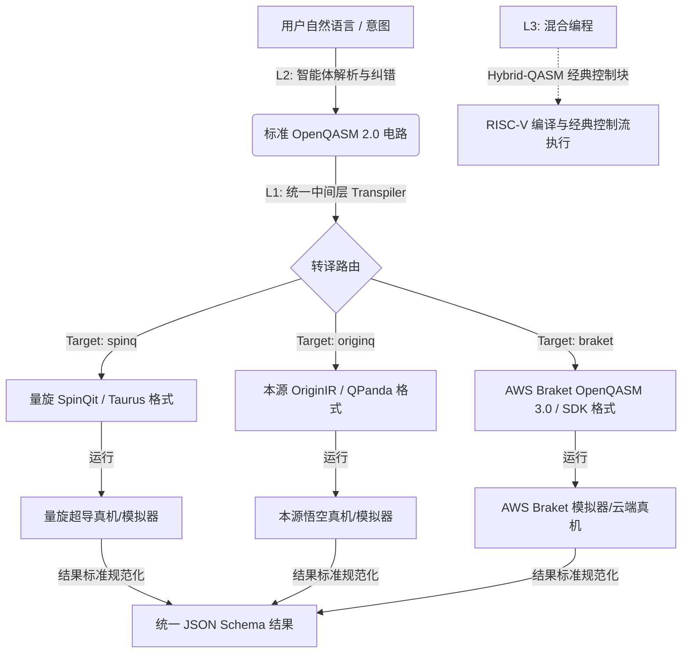

# LoomQ · 量子接入平权计划 (Quantum Accessibility Equality Initiative)
## —— 让不懂"黑话"的人，也能指挥最前沿的算力

> **赛道**：AI 应用 / Agent / 硬核系统
> **时长**：8 月 1 日 — 8 月 25 日（线上赛）
> **建议队伍构成**：1–4 人（欢迎产品、设计、算法、系统、内容任意组合，无需量子计算学术背景）

---

## 一、赛事愿景：为什么这至关重要？ (Why this matters)

量子计算被公认为下一代算力革命的引擎，但今天的量子科技世界却面临着**最封闭、门槛最高、话语权最集中**的困境。

每一个量子云平台都在筑起自己的"黑话高墙"：本源量子采用 `OriginIR` 指令集；国盾/天衍采用 `QCIS`；量旋科技、AWS Braket、IBM 等又各有其专属的 SDK 和底层方言。这导致大量有独特问题意识、却无科班硬核背景的群体（尤其是女性及跨界创造者）被默认排除在外。

**我们相信，真正的技术跃迁，不只来自更强的芯片，更来自更低、更包容的接入门槛。**

本赛题的内核是**基础设施层面的平权**：你需要构建一个开放、统一、人人可接入的**"量子通用中间层" (LoomQ Transpiler)**，并为其配备一个**"会说人话"的智能体 (LoomQ Agent)**。让任何人都能用直觉与自然语言驱动真实的量子计算机。

你要回答的终极问题是：
> **你的工具，让哪一类原本进不来的人，第一次能够使用并受惠于量子计算？**

---

## 二、系统架构流转 (System Architecture)

下图展示了 LoomQ 系统的完整数据与控制流：



---

## 三、任务设计 (Three-Level Progression)

本题设计了三个递进的 Level，选手不需要全部做完，**完成 L1 入门档（两个模拟器后端跑通公开电路——不需要真机账号、不需要量子理论、本地即可完成）即可获得基础分并具备参赛评奖资格**，L2/L3 为加分和提分空间。

> 🧭 **没接触过量子？** Starter Kit 内附《QUANTUM 101》30 分钟速成手册：本题让你造的是"翻译器"，不是让你学物理——手册覆盖解题所需的全部概念，剩下的都是你熟悉的软件工程。

### L1｜通用中间层（核心任务，45 分）

构建转译与执行引擎。输入标准的 **OpenQASM 2.0** 电路，将其正确转译并驱动至以下后端：

1. **量旋云 (SpinQ Cloud)**：运行于 Taurus 模拟器或当前可用的真实后端。
2. **本源量子云 (Origin Quantum)**：将 QASM 翻译为 `OriginIR`，在本地模拟器或当前可用的真实后端运行；物理设备 ID 通过平台服务动态查询，不固定要求 `real_chip_wukong_72`。
3. **AWS Braket**：支持运行于 `LocalSimulator` 模拟器（免费、无需海外账号）或 AWS Braket 云端。

**门白名单（划定工作量边界）**：全部评测电路——公开、隐藏、评测日变体——只会使用以下 **12 个 qelib1 标准门**，不会出现白名单之外的门：

| 类别 | 门 |
|---|---|
| 单比特（无参） | `h, x, s, sdg, t, tdg` |
| 单比特（含参） | `rz(θ), ry(θ)` |
| 两比特 | `cx, cu1(θ), swap` |
| 三比特 | `ccx` |

L2 智能体最终返回的 OpenQASM 也必须遵守这套白名单。模型若生成其他门，必须先等价分解，再通过解析器校验后返回；不能把白名单外的门直接交给 L1。

逐个确认三家 SDK 对这 12 个门的支持，就是 L1 的完整工作量清单。若某后端不支持个别门，Starter Kit 的 `gate_identities.md` 提供可直接照抄的等价分解（已经官方参考模拟器数值验证）。

**入门档（评奖资格线）**：同一套中间层在 **≥ 2 个模拟器后端**跑通全部公开电路。不涉及真机账号与排队，纯本地可完成。
**满分线**：三平台统一适配 + 全部 8 个电路保真度达标 + 至少 2 个平台的真机证据（三套硬编码分支不算"通用"，评委会审查架构）。
**真机定位**：真机接入是**加分阶梯，不是资格闸门**——排队、审批等外部因素不会把任何队伍挡在评奖之外，但"第一次指挥真实量子计算机"值得你去拿这 10 分。

### L2｜说人话的智能体（AI 加分项，30 分）

> **本级不需要任何量子知识**，是为跨界团队设计的主场：核心是 LLM 工程——prompt 设计、工具调用，以及"生成 QASM → 用自己的 L1 跑一遍自验 → 不对就重试"的闭环。有 LLM 应用经验的产品团队在这一级没有任何劣势。

**L2 到底要交付什么（按目标分数区分）**：

- **只做客观部分（最高 20 分）**：不要求另做网页、App、桌面软件或图形界面。选手必须在 `starter_kit/adapter.py` 中提交可运行的 `agent_chat(prompt: str) -> str`：评测器会直接调用该函数；函数须读取组委会注入的 `LOOMQ_LLM_*` 配置，至少完成一次有效模型调用，并在返回文本中正确完成下述三类任务。通过 API 调用配合 Prompt／Agent 逻辑实现即可，技术栈不限。
- **冲完整 30 分**：在上述可自动评测代码之外，再提供一个可由零基础用户直接操作的 Agent 入口。网页、桌面／移动端或 CLI 均可，不强制图形界面；须在证据包中写明启动命令、测试入口和 3 个用户体验任务，工作人员以最终提交代码实际运行评分。
- **不构成有效交付**：只提交 Prompt 文档、对话截图、录屏或由选手人工操作第三方聊天产品，均不能替代可运行的 `agent_chat` 代码或交互入口。

“生成 QASM → 用自己的 L1 跑一遍自验 → 不对就重试”是提高正确率的推荐工程方案，不是客观 20 分对软件形态的硬性要求；客观分只按模型调用合规性与最终答案正确性判定。此处仅说明 L2 自身的交付边界，不改变 L1 入门档作为评奖资格线的要求。

构建辅助前端的 Agent，降低非技术人员的门槛：

- **自然语言生成**：根据意图表述自动写出正确的 OpenQASM 2.0 代码。
- **纠错与修复**：识别语法/语义错误，在**保持用户声明意图**的前提下修复电路。
- **智能选后端**：根据比特数、拓扑结构、排队与成本约束推荐后端。

> **统一模型要求**：正式 L2 评分由 DeepSeek `deepseek-v4-flash` 驱动；最终答案仍由客观测试判定，不使用 LLM 充当裁判。组委会赛前不提供 API 地址、API Key、代理或额度。选手可自备 DeepSeek API，或使用其他 OpenAI-compatible 服务进行本地调试。评测使用**未公开的 prompt 变体**，靠关键词匹配硬编码应答无法通过（见第六节反作弊条款）。

### L3｜Hybrid-QASM × RISC-V 混合编译（硬核系统挑战，15 分）

实现经典-量子混合程序编译。输入一段 **Hybrid-QASM**（语法定义见下），你的编译器需要输出两部分：

1. **量子操作序列**：剥离出的纯量子门/测量指令列表；
2. **RISC-V 汇编文本**：实现经典控制逻辑，可在官方提供的 **`riscv_emulator.py`** 轻量模拟器中运行（支持 `li, add, sub, addi, beq, bne, j` 指令子集，无需搭建 QEMU）。

**Hybrid-QASM 语法定义**（在 OpenQASM 2.0 基础上扩展一个经典逻辑块，机器可解析，不用自然语言注释描述语义）：

```text
OPENQASM 2.0;
include "qelib1.inc";
qreg q[2];
creg c[2];
h q[0];
measure q[0] -> c[0];
classical {                 // 经典控制块：测量结果 c[0] 由评测系统注入 x10 寄存器
  if (c[0] == 1) {
    r1 = 100;               // r1..r9 映射到 RISC-V x1..x9 通用寄存器
  } else {
    r1 = 10;
  }
  r1 = r1 + 5;
}
cx q[0], q[1];
```

经典块的迷你文法：整数字面量、寄存器变量 `r1..r9`、运算符 `+ - == !=`、`if/else` 与顺序赋值。测量位 `c[k]` 依次映射到 `x10, x11, ...`。评测将**随机生成**符合该文法的用例并注入不同测量值，验证寄存器终态 100% 正确——所以必须实现真正的解析与编译，硬编码样例输出无法通过。

---

## 四、提交契约 (Submission Interface)

正式提交是选手对 `QAIDAO/LoomQ-2026` 的公开 fork，其中 **`starter_kit/` 是构建与评测根目录**，必须保留并填写 `starter_kit/submission.yaml`，同时提供 `starter_kit/adapter.py`。`submission.yaml` 声明 Starter Kit 版本、参赛 Level、运行时与网络需求；非 Python 技术栈可在 `adapter.py` 中通过 `subprocess` 调用自己的 CLI/二进制。评测只认固定接口行为，不限制内部技术栈。

Starter Kit 合同版本为 **v1.0**。开赛后，v1.x 只做向后兼容的文档、诊断与公开测试更新；任何破坏性接口变更必须发布新合同版本，并保留旧版评测通道。

```python
def transpile(qasm_str: str, target: str) -> str:
    """将 OpenQASM 2.0 转译为目标后端的原生指令字符串。target ∈ {'spinq','originq','braket'}"""

def run(qasm_str: str, target: str, shots: int) -> dict:
    """运行电路并返回符合大赛标准 Schema 的字典结果"""

def agent_chat(prompt: str) -> str:
    """[L2 可选] 从 LOOMQ_LLM_* 环境变量读取配置，返回智能体响应文本"""

def compile_hybrid(hybrid_qasm_str: str) -> Tuple[list, str]:
    """[L3 可选] 混合编译接口。输入 Hybrid-QASM，返回 (量子操作序列, RISC-V 汇编文本)"""
```

`transpile()` 返回值必须符合 Starter Kit 的 `target_ir_contract.md`：SpinQ 使用 OpenQASM 2.0、Braket 使用 OpenQASM 3、OriginQ 使用规范 OriginIR 子集。正式评测会由组织方解析并模拟目标 IR；非空占位字符串不构成有效转译。

**统一结果 Schema（`run` 返回值，所有后端必须一致）：**

```json
{
  "backend": "spinq_taurus",
  "job_id": "xxxxxxxx",
  "shots": 8192,
  "counts": {"000": 4102, "111": 4090},
  "bit_order": "little",
  "timestamp": "2026-08-01T12:00:00Z",
  "meta": {"transpiled_gates": 12, "depth": 5}
}
```

**bit order 规范**：`counts` 的 key 是经典寄存器位串，**最右侧字符为 `c[0]`**（即 key = `c[n-1]…c[1]c[0]`，与 Qiskit 约定一致），`bit_order` 固定填 `"little"`。跨平台位序差异必须在中间层内归一化——这正是"通用"的一部分。

**L2 运行时规范**：选手程序必须通过 `LOOMQ_LLM_BASE_URL`、`LOOMQ_LLM_API_KEY` 和 `LOOMQ_LLM_MODEL` 读取模型服务配置，不得硬编码 API 地址、密钥或模型名称。正式评测时，组委会将统一注入 DeepSeek 模型服务及调用预算；评测环境不保证能够访问其他外部网络服务。完整机器可读规则见 Starter Kit 的 `l2_policy.json`。

**可复现性要求**：第三方依赖必须精确锁定版本；正式评测以提交系统记录的完整 40 位 commit SHA 为准，在固定 Linux 容器内构建。公开 `evaluator.py` 只用于契约自测，其输出不是正式分数。

### 最终提交流程

1. 在 fork 根目录运行 `python3 starter_kit/prepare_submission.py --team-id <TEAM_ID>`，确认工作区干净、HEAD 已 push 且必需文件齐全。
2. 在 `QAIDAO/LoomQ-2026` 中创建“LoomQ 最终提交” Issue，填写队伍 ID、fork 地址与预检输出的完整 commit SHA。
3. 自动校验通过后，Issue 会获得 `submission:accepted` 标签和包含归档 SHA-256 的回执；只有此状态构成有效提交。

**截止时间：2026 年 8 月 25 日 12:00（UTC+8）**。以 GitHub 服务器记录的 Issue `created_at` 为准，不以 commit 时间或选手本地时间为准。同队伍可在截止前通过新 Issue 重新提交，截止前最后一次通过校验的提交生效；不可编辑已有 Issue 来替换提交。

---

## 五、评测与判定标准

### 1. L1 判定（45 分）：语义等价与真机校验

- **语义等价性（35 分）**：官方测试电路集共 8 个——`Bell`、`GHZ-3`、`GHZ-5`、`QFT-4`、`Grover-3`、`Random-Circuit×3`，全部使用第三节的 12 门白名单。其中 **Bell 与 GHZ-3 随 Starter Kit 公开供自测，其余由组织方评测器在内存中按私有种子生成**。每个 case 在隔离子进程中执行，选手进程只收到当前输入，不会获得理想分布文件。
  选手转译后的电路在**无噪声模拟器**上以 **shots = 8192** 采样，得到分布 $P$，与理想分布 $Q$ 计算 Hellinger 保真度：
  $$H(P, Q) = \frac{1}{\sqrt{2}}\sqrt{\sum_i \left(\sqrt{p_i} - \sqrt{q_i}\right)^2}, \qquad \text{Fidelity} = 1 - H(P,Q)$$
  **通过阈值：Fidelity ≥ 0.97**。（该阈值已为 8192 shots 的统计涨落留出余量：完美实现的期望保真度约 0.99+，而任何门级转译错误都会使保真度骤降至 0.9 以下，区分度充分。）
- **真机接入证据（10 分）**：真机是 L1 的额外加分，不是入门资格线或 L2 交互的强制条件。提交各平台真机返回的原始 `result.json`，评测组核验：
  - Schema 合法且字段完整；
  - `counts` 的 **Top-K 主导态**与理想分布一致（真机允许噪声，只查主峰命中）；
  - `job_id` 可在对应平台控制台溯源、`timestamp` 落在赛程窗口内。**评测组将抽样登录平台复核 job_id**，无法溯源的记录按无效处理。

**L1 评分阶梯**（每一档都是新手可企及的"下一步"）：

| 档位 | 条件 | 分值 |
|---|---|---:|
| 入门（评奖资格线） | 同一中间层在 ≥2 个模拟器后端跑通公开电路 | 12 |
| 进阶 | 第三个平台打通 / 隐藏电路保真度达标，按覆盖度线性计分 | 至 35 |
| 真机 | 每个平台真机主峰命中 +5（至多 2 个平台） | +10 |
| 满分 | 三平台统一适配 + 8 电路全过 + 2 平台真机 | **45** |

### 2. L2 判定（30 分）：智能体客观评测与交互体验

- **黑盒 Prompt 注入测试（20 分）**：评测系统向 `agent_chat` 注入三类任务，**实际评测 prompt 为未公开的同类变体**（改写措辞、更换比特数与目标态），下面仅为示例形态：
  1. **意图生成**：*"生成一个 3 比特的最大纠缠态 (GHZ 态)，并进行全测量"* —— 产物 QASM 经无噪声模拟器验证，Fidelity ≥ 0.97 视为通过。
  2. **代码纠错**：*"我想制备一个贝尔态，但这段代码报错了，帮我修好：`H q[0]; CX q[0] q[1]`（未定义寄存器且门名大小写错误）"* —— prompt 中**明确声明目标态**，修复产物必须在语义上实现该目标态并通过 Fidelity 验证。
  3. **智能选后端**：*"我需要运行一个 15 比特电路，且零排队等待，选哪个平台？"* —— Agent 回复须包含一个**规范后端标识**（如 `braket_local_simulator`），评测按官方《后端能力表》（比特数上限 / 排队特性 / 费用，见 Starter Kit 的 `backend_capabilities.md/json`）核对唯一正确答案集。
  - 客观分 = 各变体通过率 × 20。
  - **交付形式**：只要求可被评测器自动调用的 `agent_chat` 代码，不要求 UI 或独立应用；Prompt 文档、截图和人工演示不计入该 20 分。
  - 正式评测使用 2 个固定私有种子，共 12 个 L2 case，每个时限 120 秒。选手程序必须至少完成一次有效的模型服务调用，该 case 才具备得分资格。
  - 组委会模型服务或网络发生基础设施异常时，不直接判定选手失败；服务恢复后将按统一规则复评。
- **平权叙事与交互体验（10 分）**：在客观评测代码之外提供可运行的用户入口，网页或 CLI 均可。工作人员依据最终提交代码，在统一评测环境中测试 Agent 面对零物理背景用户的交互友好度、容错提示与结果可视化；截图或录屏只能说明流程，不能替代可运行的提交。**仅在客观分 ≥ 12 时计入**，防止"只有故事没有工具"。

### 3. L3 判定（15 分）：混合编译正确性

- 评测系统按第三节文法**随机生成 N 组 Hybrid-QASM 用例**（不同分支结构、不同常量、不同测量位数）。
- 对每组用例：将 `compile_hybrid` 输出的 RISC-V 汇编载入官方 `riscv_emulator.py`，**穷举注入所有测量值组合**，逐一比对寄存器终态与参考解释器的结果；同时校验量子操作序列与原电路量子部分语义等价。
- 全部用例、全部注入组合通过得满分；判定完全确定性、无主观分。

### 4. 工程与产品化叙事（10 分）

- 一键 `setup + run` 可复现（评委在干净环境按 README 一条命令跑通）。
- 代码质量、架构文档清晰。
- **必答题**：你的工具让哪一类原本进不来的人，第一次能用上量子计算？（提供 Web 界面、无代码引导等佐证最佳）

### 5. Bonus 额外加分（最高 +12 分）

- **自定义量子 RISC-V 扩展指令（+8）**：设计 custom opcode 编码量子操作，需同时提交：① 指令编码规格文档；② 对官方模拟器的扩展实现（fork `riscv_emulator.py` 增加指令支持）；③ 可运行的端到端测试。三者齐备方计分。
- **卓越的新手引导与视觉叙事（+4）**：评委主观评定。

### 评分总表

| 模块 | 分值 | 核心考点 |
|---|---:|---|
| L1 通用中间层 | 45 | 是否真正"统一"地打通多平台 |
| L2 智能体 | 30 | 能否让不懂 QASM 的人也能用 |
| L3 混合编译 | 15 | 量子-经典混合编译硬核能力 |
| 工程与产品化 | 10 | 可复现、可交付、有叙事 |
| **Bonus** | **+12** | 极客深度与包容性设计 |
| **合计** | **100 (+12)** | |

---

## 六、反作弊与判定诚信条款

Starter Kit 只提供接口骨架、公开电路和公开自测，**不包含可得分 Mock、针对评分 Prompt 的示例答案或 L3 参考实现**。原样提交不会获得功能分：

1. `meta` 中含 `is_mock: true`、或 `job_id` 无法在对应平台溯源的结果，**该测试点计 0 分**。
2. L1 隐藏电路、L2 prompt 变体、L3 随机用例均在评测时生成，**针对公开样例硬编码输出的实现将在隐藏集上自然失败**。
3. 正式评测包含自动化变体复测与必要的代码审查；评测系统将替换输入重新运行。发现关键词匹配式伪 Agent、打表式伪编译器，对应 Level 判 0 分并取消该模块奖项资格。
4. 允许并鼓励使用 AI 辅助编程，但队伍须在 README 或架构文档中说明系统各部分的工作原理，供异步审查；不设置现场答辩或现场解释环节。
5. 正式评测器由组织方持有，不复制到选手仓库运行；每个 case 设置 CPU、内存和超时限制，默认禁止网络。L2 由组委会统一注入模型服务配置，评测环境不保证能够访问其他外部网络服务。

---

## 七、平台接入

| 平台 | 接入方式 | 说明 |
|---|---|---|
| **量旋云 / SpinQit** | `uv pip install spinqit` (或 `pip install spinqit`)，自带 Taurus 本地模拟器，可接当前可用真机 | 真实后端以平台当前在线设备为准，维护期间可只做本地测试 |
| **本源量子云** | pyqpanda / QPanda3，QASM→OriginIR，可接当前可用真机 | 通过 `QCloudService` 动态查询设备，需自行申请 API Token |
| **AWS Braket** | `LocalSimulator` 本地模拟器免费、无需 AWS 账号 | 允许以本地模拟器替代付费云端真机 |

**参考资料**：

- **量旋 SpinQit**：[SpinQit 官方文档](https://doc.spinq.cn/doc/spinqit/index.html) · [GitHub 源码](https://github.com/SpinQTech/SpinQit) · [产品介绍页](https://www.spinq.cn/products-solutions/spinqKit)
- **本源量子**：[本源量子云平台](https://qcloud.originqc.com.cn/zh) · [pyQPanda 中文文档](https://pyqpanda-toturial.readthedocs.io/) · [真机服务用户手册](https://qcloud.originqc.com.cn/document/usermanual/rst/Computing_service1.html)
- **AWS Braket**：[开发者文档](https://docs.aws.amazon.com/braket/) · [Python SDK](https://github.com/amazon-braket/amazon-braket-sdk-python) · [官方示例库](https://github.com/amazon-braket/amazon-braket-examples)

---

## 八、评委看重什么

1. **"通用"是否名副其实**——是三套硬编码，还是一个真正抽象的中间层？
2. **门槛是否真的被降低**——一个没写过 QASM 的人，能不能靠你的 Agent 在 5 分钟内跑出第一个量子程序？
3. **可复现性**——评委能不能一条命令跑起来？
4. **平权叙事的真诚度**——你是否真正想清楚了"为谁而做"。

> **这道题不奖励"最懂量子的人"，奖励"让最多人能用上量子的人"。**

---

## 九、大赛专项奖项设置 (Special Awards)

🏆 **"LoomQ 最佳包容性设计与优秀体验奖 (Best Inclusivity & UX Award)"**

- **评选资格**：在 L2 智能体交互、新手引导体验、无门槛可视化方向得分突出的队伍。
- **评选标准**：工具是否能做到"让一位没有任何量子背景的跨界创作者，在 5 分钟内依靠智能体引导，完成自然语言 → QASM → 运行验证，并理解其科学原理"。本奖项重点考察 L2 交互、新手引导和无门槛可视化，不要求用户登录真机；真机属于 L1 额外加分。
